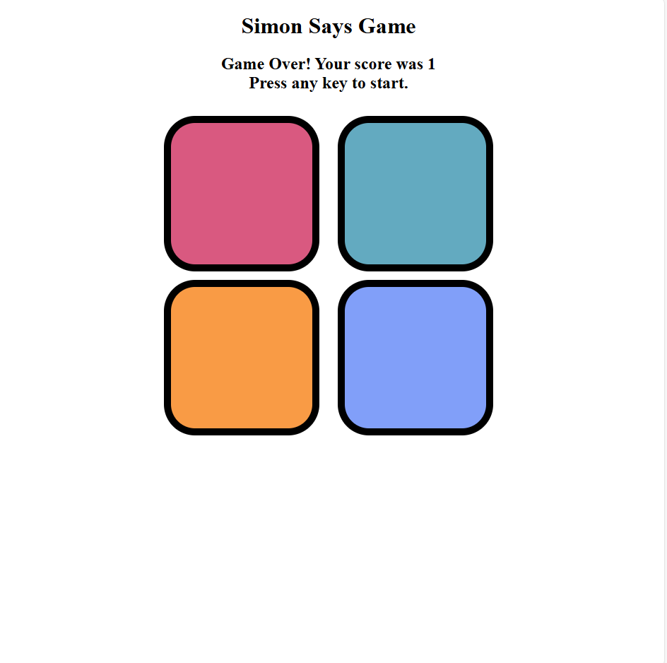

# Simon-Says-Game

Features:
- Responsive and attractive UI with smooth animations.
- Tracks and displays the current level and high score.
- Error feedback with flashing red screen for incorrect sequences.
- User-friendly design with a simple and intuitive interface.

## How to Play:
1. Press any key to start the game.
2. Watch the flashing color sequence.
3. Repeat the sequence by clicking the colored buttons.
4. The sequence length increases with each level.
5. A wrong sequence ends the game, and the high score is updated.

## Technologies Used:
- **HTML**: Structure of the game.
- **CSS**: Styling and animations.
- **JavaScript**: Game logic and interaction.

Click here to play:
 https://hariom045418.github.io/Simon-Says-Game/

### Preview:
![Game Preview]

---

## 📖 How to Use
1. Clone the repository:
   git clone  https://hariom045418.github.io/Simon-Says-Game/

2. Open index.html in your browser.
